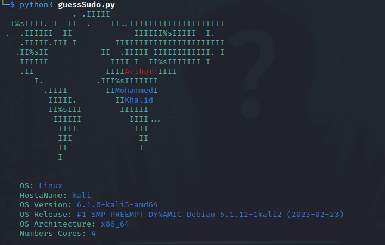
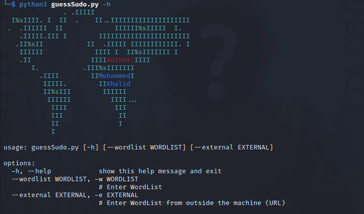
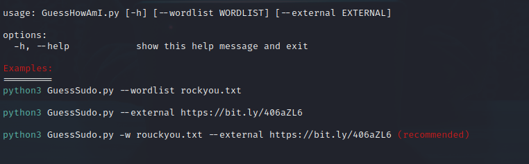

# GuessHowAmI

**GuessHowAmI** : It is a guessing tool that attempts to use the current sudo user, to try to access the root user


## Features
*	You are trying to get the root user through sudo by guessing on more than one wordList method
*	Non-disclosure of the system owner
*	You can use an external wordlist online


## Defects
* Your account may be closed or anything else based on certain rules set by the owner of the system


## Installation
Download GuessHowAmI by cloning the Git repository:
<br />```$ git clone https://github.com/Dark-Night0/GuessHowAmI.git```
<br />```$ chmod +x requirements.sh```
<br />```$ ./requirements.sh ```

## Usage
<br />```$ python3 guessSudo.py```
<br />


Display Help menu Enter command on terminal 
<br />```$ python3 guessSudo.py -h```
<br />



## Example

**scroll down**

  

## Author

 **Facebook** 
* [Mohammed Khalid](https://www.facebook.com/profile.php?id=100085121092587)

 **Twitter** 
* [0xDARK3](https://twitter.com/0xDARK3)

<br>
